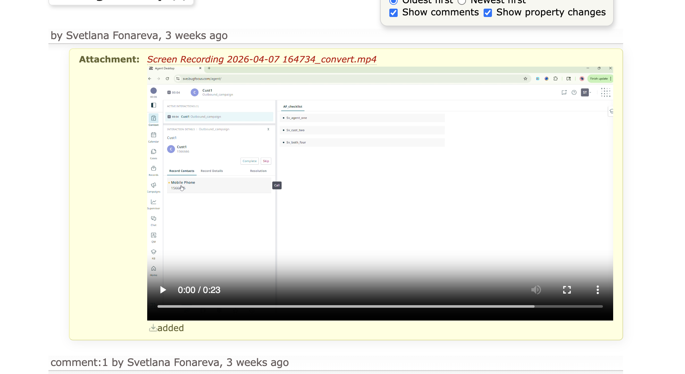
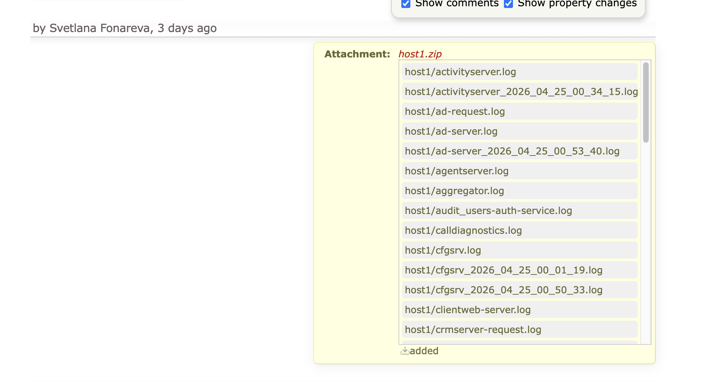

# Better Trac

Script for [trac.brightpattern.com](https://trac.brightpattern.com).

Adds:

1. **Inline attachment previews** — renders images, videos, zip contents, and HAR files directly on ticket pages.

   
   

2. **Paste to upload** — `Ctrl+V`/`Cmd+V` outside a text field opens the upload page in a new tab; pasting an image on the upload page fills the file input automatically.

## Build

```
yarn install
yarn build   # → dist/better-trac.js
```

Add the built `better-trac.js` to the Trac page (e.g. via a site-wide script include) to enable the features for everyone.
